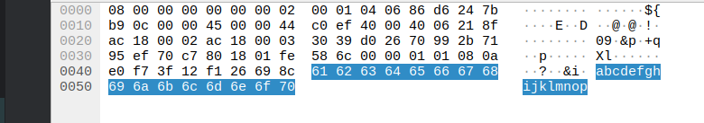

# Simple client - server chat with Docker and Python

This simple example will show how to host one server and two clients and chat via the clients using the server.

## Setting up

Simply run `docker compose build` to build the containers

## Run the chat

First start the server from a terminal (cmd.exe, powershell, Linux/Mac terminal)

```shell
  docker compose up 
```

Then open another command shell for the first chat-party and run 
```shell
  docker attach chat_client_1
```

Repeat for the second chat-party open another shell and run

```shell
  docker attach chat_client_2
```

To **end the chat session** press `Control+P` then `Control+Q`. 


Now start typing in last two and see how the chat is taking place.

# Joining the chat from the host

It is possible to join the server from the host if the `server.py` script runs within the Docker server. Make sure
you have Python installed. If running from Windows, please install `windows-curses` using `pip install`.

Note that we use the `localhost` hostname here, but we might as well have used `127.0.0.1`. This is because the Docker
ip-address is not reachable, but the port `12345` is exposed! 

```text
python.exe client.py -i localhost -p 12345 MyHipsterUsername

```

# Using Wireshark to listen in on the conversation (Linux)

When using Windows as a host system it is not possible to listen in on the network traffic. Instead, a different
approach is used. Please see 

Install and run Wireshark (as admin/sudo). Find the network card created for Docker:
```shell
  docker exec -it chat_server cat /sys/class/net/eth0/iflink
  153
```

This number `153` should match an interface on your host. For Linux:
```shell
  ip addr | grep 153
```

Yields something like:
```text
  153: vethbc5b317@if152: <BROADCAST,MULTICAST,UP,LOWER_UP> mtu 1500 qdisc noqueue master br-03669f8067d9 state UP group default 
```

Notice the text `vethbc5b317`. In Wireshark this interface should be present in the list with interfaces:


In the image above the correct interface is highlighted in blue. Just double click on this interface and start typing. 

# Using Wireshark to listen in on the conversation (Windows)

The server will create a tcpdump data file that can be read using Wireshark. So after sending some data using the
chat client, you will see a data file being filled at the folder `./server/data/dump.pcap`.

You can open this file using Wireshark and see the same data, only be it not the live data. Using the refresh-button
in the menu of Wireshark we can simulate the live-viewing of data.

# Finding the data in Wireshark

When data is viewed in Wireshark look for an entry like below:


Look in the column 'Info' and look for the text `[PSH, ACK]`.When clicking this line the data becomes visible in the 
lower section of the screen. In the example below we sent the text `abcdefghijklmnop` which is clearly visible in the
right-hand side of this section.



# Security implications

1. the person maintaining the server can see all
2. using Wireshark we see that the messages are unencrypted so anyone can listen in
